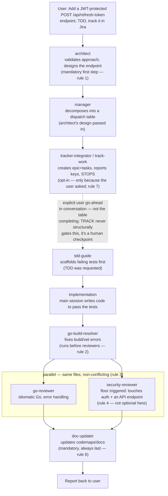

# claude-setup

My configurations, scripts, skills, etc., for Claude Code. Got many things (including this structure) from this [amazing](https://github.com/affaan-m/everything-claude-code) project.

## Dependencies

* serena ([https://oraios.github.io/serena/02-usage/030_clients.html](https://oraios.github.io/serena/02-usage/030_clients.html))
* rtk ([https://github.com/rtk-ai/rtk](https://github.com/rtk-ai/rtk))
* caveman ([https://github.com/JuliusBrussee/caveman](https://github.com/JuliusBrussee/caveman))

### Installation

Just clone this repo as:

```
# in a fresh install, before the claude installation:
$ git clone https://github.com/GiovaneRibeiro-neuro/claude-setup.git ~/.claude

# or, in an existent claude install:

$ cp -r ~/.claude ~/.claude.bkp
$ git clone https://github.com/GiovaneRibeiro-neuro/claude-setup.git ~/.claude
$ cp -r ~/.claude.bkp/**/*.* ~/.claude/
```

## Tracker integration (optional)

`tracker-integrator` / `/track-work` create tracker (Jira) epics/tasks from an approved
plan. Connection details, custom-field mappings, and the card/epic description template
are **per-client**, not host-global — each client gets its own `TRACKER.md` under
`~/workspace/<client_name>/`, resolved at runtime by the `client-context` skill
(walks up from the current working directory looking for a client folder; asks which
client if that fails — see `skills/client-context/SKILL.md`).

Before using `tracker-integrator` or `/track-work` for a new client:

1. Copy the blank templates from `~/workspace/_templates/client/` into a new
   `~/workspace/<client_name>/` folder: `VOCABULARY.md`, `CONTEXT-MAP.md`,
   `EPIC-STANDARDS.md`, `TRACKER.md` (and `CONTEXT.md` too, if you'll also use
   `pm-assistant` for Jira health reports/Epic authoring against this client).
2. Fill in `TRACKER.md` with your org's cloud id, project keys, required custom-field
   IDs, and description template — see `skills/tracker-adapter/adapters/jira.md` for the
   concrete Jira call sequence that reads it.
3. Optionally fill in `VOCABULARY.md` if you want stakeholder names auto-suggested for
   an Epic's "Stakeholders" section.

These files hold org-specific values on purpose and live outside this repo entirely —
`~/workspace/<client_name>/` isn't part of `~/.claude`, so there's nothing to gitignore
here. Design history for this and related decisions, if a client has one recorded, lives
at `<client_name>/_docs/adr/` — not in this repo, for the same reason the connection
details above aren't: real org-specific facts shouldn't be committed here even as
historical record.

## Example: a complete development flow

This walks one request through the full agent orchestration this repo defines — see
`rules/common/agents.md` for the roster and sequencing rules referenced below (rule
numbers in parens are that file's).



### Walkthrough

Scenario: *"Add a JWT-protected `POST /api/refresh-token` endpoint to the auth service,
write tests first, and track it in Jira."*

1. **You** (the main Claude Code session — subagents can't call the `Agent` tool
   themselves, so this orchestration always happens at the top level or in an agent that
   explicitly has `Agent` access) invoke **`architect`** first with the raw request. It
   comes back with a design: token-refresh contract, where it slots into the existing
   auth module, error-handling shape, and any storage/schema implications.

2. You invoke **`manager`** second, including architect's design in the prompt. Manager
   returns a dispatch table. Because the request touches an API endpoint and auth
   (rule 4's floor), `security-reviewer` is in the table even though the user never said
   "security" — manager scans for that regardless of what was asked. Because the user
   *did* ask to track the work, `tracker-integrator` is included too (rule 7) — it
   wouldn't be by default.

3. You execute the table's steps via the `Agent` tool, in the order/parallelism manager
   specified:
   - **`tracker-integrator`** (via `/track-work` or directly) creates the epic + linked
     tasks, reports the issue keys/links, and stops. Its approval gate means
     implementation does **not** start yet — that needs your explicit "go" in
     conversation, separate from this table completing.
   - Once you confirm: **`tdd-guide`** scaffolds the failing tests for the new endpoint
     (interface first, per TDD).
   - Implementation happens (in this session or a delegated agent) to make those tests
     pass.
   - **`go-build-resolver`** runs before any reviewer touches the same code (rule 2),
     clearing build/vet/lint noise so reviewers aren't reading around compile errors.
   - **`go-reviewer`** and **`security-reviewer`** run **in parallel** (rule 3) — they
     cover the same files but don't conflict, and the security pass is mandatory here
     specifically because of the auth/endpoint floor (rule 4), not because anyone asked
     for it.
   - **`doc-updater`** runs last, unconditionally (rule 6) — updates codemaps/docs even
     though nobody asked for documentation either.

4. Final report to the user bundles: the created Jira issue keys/links, what changed,
   review findings (if any survived), and what docs got touched.

Two things this scenario is chosen to demonstrate:
- **Floors aren't suggestions.** `security-reviewer` and `doc-updater` show up whether or
  not the user's wording mentioned them, because the request's *shape* (an auth-touching
  endpoint; a code change at all) triggers them.
- **Opt-in stays opt-in.** `tracker-integrator` only appears because tracking was
  explicitly requested, and its own completion doesn't unblock implementation — your
  separate confirmation does (see `skills/tracker-adapter/SKILL.md`'s "Approval gate").
