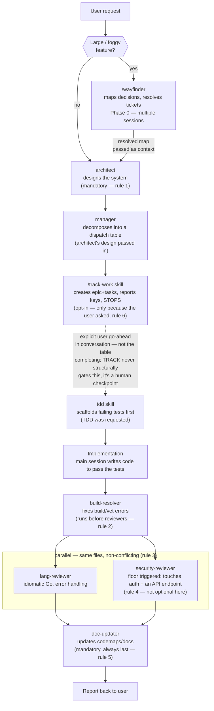

# claude-setup

My configurations, scripts, skills, etc., for Claude Code. Got many things (including
this structure) from this [amazing](https://github.com/affaan-m/everything-claude-code)
project.

## Installation

The repo lives outside `~/.claude/` and tracked files are **symlinked in** — so runtime
files (credentials, cache, session data) never share a directory with git-tracked content
and can't accidentally be committed.

```bash
# 1. Clone the repo wherever you keep dotfiles
git clone https://github.com/giovanebribeiro/claude-setup.git ~/workspace/claude-setup

# 2. Run the installer
bash ~/workspace/claude-setup/install.sh
```

The installer symlinks each tracked item (`agents/`, `commands/`, `skills/`, `CLAUDE.md`,
etc.) into `~/.claude/`. Anything that was already there gets backed up to
`~/.claude-setup-backup/<timestamp>/` before being replaced.

**Git workflow after install:** always `cd ~/workspace/claude-setup` to commit and push —
never run git from inside `~/.claude/`.

To remove the symlinks (runtime files are never touched):

```bash
bash ~/workspace/claude-setup/uninstall.sh
```

### Installing individual skills via vercel-labs/skills

If you only need specific skills (without the full symlink setup), use the
[vercel-labs/skills](https://github.com/vercel-labs/skills) CLI to install
individual skills into any project or globally:

```bash
# List available skills
npx skills add giovanebribeiro/claude-setup --list

# Install a specific skill into the current project
npx skills add giovanebribeiro/claude-setup --skill jira-project-health

# Install all skills globally
npx skills add giovanebribeiro/claude-setup -a claude-code -g -y
```

## Dependencies

| Dependency | Install |
|---|---|
| [serena](https://oraios.github.io/serena/02-usage/030_clients.html) | See link |
| [rtk](https://github.com/rtk-ai/rtk) | See link |
| [caveman](https://github.com/JuliusBrussee/caveman) | See link |
| [mattpocock/skills](https://github.com/mattpocock/skills) | `claude mcp add --transport http mattpocock-skills https://skills.aihero.dev/mcp` |

### Pocock skills used by this repo

| Skill | Role |
|---|---|
| `/grill-me` | Interactive design drilling; used inside Wayfinder grilling tickets |
| `/wayfinder` | Large-feature planning via decision tickets |
| `/to-spec` + `/to-tickets` | Spec-to-Jira flow (replaces `tracker-integrator` agent) |
| `tdd` (model-invoked) | Red-green-refactor loops (replaces `tdd-guide` agent) |
| `diagnosing-bugs` (model-invoked) | Hard-bug triage: minimize → hypothesize → instrument → fix |
| `domain-modeling` (model-invoked) | Domain model review and edge-case stress tests |
| `/handoff` | Compact conversation → handoff doc for another agent |

## Tracker integration (optional)

`/track-work` (backed by the `tracker-adapter` skill) creates Jira epics/tasks from an
approved plan. Config is **per-client** — each client gets its own folder under
`~/workspace/<client_name>/` with `TRACKER.md`, `VOCABULARY.md`, `CONTEXT-MAP.md`, and
`EPIC-STANDARDS.md`.

Before using `/track-work` for a new client:

1. Copy templates from `~/workspace/_templates/client/` into `~/workspace/<client_name>/`.
2. Fill in `TRACKER.md` with cloud id, project keys, custom-field IDs, and description
   template — see `skills/tracker-adapter/adapters/jira.md` for the concrete call sequence.
3. Optionally fill in `VOCABULARY.md` for stakeholder name auto-suggestions.

These files live outside this repo intentionally — `~/workspace/<client_name>/` is not
part of `~/.claude`, so there is nothing to gitignore.

## Development flow

The diagram below shows a full request through the agent orchestration. Rule numbers
refer to `rules/common/agents.md`.

Large or foggy features start with Wayfinder (Phase 0) before entering the execution
path. Clear, scoped requests skip directly to `architect`.


```mermaid
flowchart TD
    U["User request"] --> FORK{{"Large / foggy\nfeature?"}}

    FORK -->|yes| WAY["/wayfinder\nmaps decisions, resolves tickets\nPhase 0 — multiple sessions"]
    FORK -->|no| ARCH

    WAY -->|"resolved map\npassed as context"| ARCH

    ARCH["architect\ndesigns the system\n(mandatory — rule 1)"] --> MGR

    MGR["manager\ndecomposes into a dispatch table\n(architect's design passed in)"] --> TRACK

    TRACK["/track-work skill\ncreates epic+tasks, reports keys, STOPS\n(opt-in — only because the user asked; rule 6)"] -.->|"explicit user go-ahead\nin conversation — not the table\ncompleting; TRACK never structurally\ngates this, it's a human checkpoint"| TDD

    TDD["tdd skill\nscaffolds failing tests first\n(TDD was requested)"] --> IMPL

    IMPL["Implementation\nmain session writes code to pass the tests"] --> BUILD

    BUILD["build-resolver\nfixes build/vet errors\n(runs before reviewers — rule 2)"] --> REV
    BUILD --> SEC

    subgraph PAR["parallel — same files, non-conflicting (rule 3)"]
        REV["lang-reviewer\nidiomatic Go, error handling"]
        SEC["security-reviewer\nfloor triggered: touches auth + an API endpoint\n(rule 4 — not optional here)"]
    end

    REV --> DOC["doc-updater\nupdates codemaps/docs\n(mandatory, always last — rule 5)"]
    SEC --> DOC
    DOC --> DONE["Report back to user"]
```

### Step-by-step execution

Each step is a prompt to type into the Claude Code session. Parallel steps must be sent
in a **single message** so they run concurrently.

---

**Step 0 — Wayfinder (large / foggy features only)**

When the feature is too big or too unclear for a single session, chart a decision map
first:

```
/wayfinder
```

Work through the decision tickets over multiple sessions. When the map has no open
unblocked tickets and the destination is clear, copy the resolved map (Destination +
Decisions-so-far sections) — you will pass it to architect in Step 1.

Skip this step for scoped, well-defined requests.

---

**Step 1 — Architect (mandatory first)**

```
@architect Add a JWT-protected POST /api/refresh-token endpoint to the auth service.
Design the token-refresh contract, where it slots into the existing auth module,
error-handling shape, and any storage/schema implications.

# If preceded by Wayfinder, append:
Context from Wayfinder map:
- Destination: <paste>
- Decisions resolved: <paste Decisions-so-far>
```

Wait for the design. Copy the full output — you will pass it to manager.

---

**Step 2 — Manager (decompose into a dispatch table)**

```
@manager Here is the architect's design for a JWT-protected POST /api/refresh-token
endpoint:

<paste architect output here>

Original request: add the endpoint, write tests first (TDD), track it in Jira.
```

Review the numbered dispatch table before executing.

---

**Step 3 — Track work (opt-in, before code)**

```
/track-work TEAM
```

Wait for issue keys and links, then confirm explicitly to unblock implementation:

```
Confirmed. Proceed with implementation.
```

---

**Step 4 — TDD: scaffold failing tests**

```
/tdd Scaffold failing tests for the JWT POST /api/refresh-token endpoint per the
architect's design. Interface first, then tests that FAIL before any implementation.
```

---

**Step 5 — Implementation**

Write code until all tests from step 4 pass. Commit when green.

---

**Step 6 — Build resolver (before any reviewer)**

```
@build-resolver Fix any build, vet, or lint errors from the refresh-token implementation.
```

---

**Step 7 — Language review + security review (parallel)**

Send both in a single message:

```
@lang-reviewer Review the refresh-token endpoint changes for idiomatic patterns,
error handling, and concurrency correctness.

@security-reviewer Review the refresh-token endpoint — this touches JWT handling
and an authenticated API endpoint.
```

Address any CRITICAL or HIGH findings before continuing.

---

**Step 8 — Documentation (mandatory last step)**

```
@doc-updater Update codemaps and docs to reflect the new refresh-token endpoint.
```
